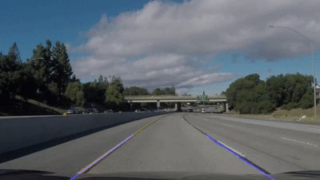
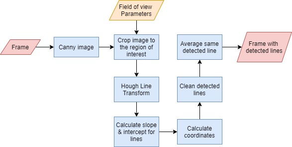

# road-lane-line-detection
Detect road lines for self-driving car

<!-- TABLE OF CONTENTS -->

  
Table of Contents

  <ol>
    <li>
      <a href="#introduction">Introduction</a>
    </li>
    <li>
      <a href="#tools">Tools</a>
    </li>
    <li><a href="#methodology">Methodology</a></li>
    <li><a href="#results">Results</a></li>
  </ol>

### Introduction
Lane Line detection is a critical component for self driving cars and also for computer vision in general.

The aim of this project is to build a model to detect lane lines in real-time using OpenCV. 

### Tools:
Python 3, OpenCV, Numpy

### Methodology:

To detect the lane we have to detect the white markings on both sides on the lane. The methodology used to achieve that is:
<li> 1. Caliberate camera by defining field of view. </li>
<li> 2. Convert each frame into canny image. </li>
<li> 3. Mask the frame to only show region of interest (camera field of view) </li>
<li> 4. Detect lines using Hough Transform </li>
<li> 5. Calculate slope & intercept for these lines </li>
<li> 6. Calculate coordinates for these lines </li>
<li> 7. Remove unrelated lines (horizontal ines, lines outside region of interest, lines with  sharp angles) </li>
<li> 8. Detected lane lines are detected many times creating a bundle of lines. The model detect these bundles and takes the average lines. </li>
<li> 9. Display lane lines on the video. </li>
